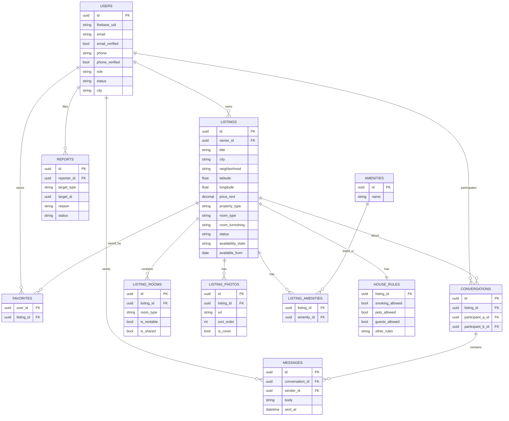

# Colocation Platform — Design Document

## 1. Overview

A web + mobile platform for finding and offering shared accommodation (colocation) in Morocco, starting with Rabat, Casablanca, Marrakech, and Tangier. It replaces scattered Facebook groups and WhatsApp listings with structured, searchable, filterable listings, in-platform messaging, user verification, and a moderation system to combat scams and unauthorized brokers ("smsar").

Two user roles operate on the same platform:
- **Offerers** — have a place, list a room with structured details (pricing breakdown, amenities, house rules, photos).
- **Seekers** — search and filter listings by location, price, amenities, and living preferences.

This document captures the MVP scope only. Future features (roommate compatibility matching, monetization/featured listings, recommendation engine) are intentionally out of scope for this phase.

---

## 2. Tech Stack

| Layer | Choice | Reasoning |
|---|---|---|
| Backend | Spring Boot (monolith) | Matches existing experience (My Heart, auth-service-saas). Monolith over microservices because the hard problems here are data modeling and moderation logic, not distributed systems. |
| Database | PostgreSQL + PostGIS | PostGIS gives indexed geospatial queries (radius search, distance sort) without hand-rolled distance math. |
| Auth | Firebase Authentication | Free for email/social login up to 50K MAU. Phone/SMS OTP is billed per message but optional at launch. Handles signup/login entirely client-side — backend never touches passwords, only verifies ID tokens via the Firebase Admin SDK. |
| Web frontend | React | Existing familiarity; shares logic with the mobile client. |
| Mobile (iOS + Android) | React Native | One codebase for both platforms, reuses React knowledge and Firebase SDK familiarity, avoids maintaining separate Swift/Kotlin apps as a solo dev. Build web first, then wrap the stabilized API with React Native. |
| File storage | Local disk or MinIO (S3-compatible) | Avoids AWS billing at MVP stage; swappable later. |
| Maps | Leaflet / MapLibre | Free, no Google Maps billing required. |

### Auth flow summary
- Client calls Firebase SDK directly for signup/login (email/password or social). Firebase never touches the backend for this step.
- Client receives a Firebase ID token (JWT).
- Client sends this token as `Authorization: Bearer <token>` on every backend API call.
- Backend verifies the token via the Firebase Admin SDK (checks signature against Google's public keys, no network round-trip per request needed after key caching).
- Backend resolves the verified Firebase UID to an internal `users` row, which holds business data: role, verification tier, ban status, city, bio.
- `POST /users` is called once, right after a client's first successful Firebase signup, to create that internal profile row. This is the closest thing to a "signup endpoint" on the backend — it does not create the identity, only the business profile linked to an identity that already exists.

### WhatsApp OTP (noted, not MVP)
Firebase phone auth only supports SMS delivery natively. WhatsApp Business API OTP delivery is cheaper and likely better-received in the Moroccan market, but requires bypassing Firebase's phone-auth flow entirely (self-built OTP generation/storage/verification, sent via WhatsApp Business API or a CPaaS provider). Treated as a v1.5 fast-follow, not part of MVP auth.

---

## 3. Data Model

### `users`
- `id` (UUID, PK)
- `firebase_uid` (unique)
- `email`, `email_verified`
- `phone`, `phone_verified` (nullable, added later)
- `first_name`, `display_name`
- `role` — enum: `USER`, `ADMIN`
- `status` — enum: `ACTIVE`, `SUSPENDED`, `BANNED`
- `city`, `bio`
- `created_at`

### `listings`
- `id`, `owner_id` (FK → users)
- `title`, `description`
- `city`, `neighborhood` (predefined list per city, not free text — keeps filters clean)
- `latitude`, `longitude` — exact coordinates, captured via map-pin drop (user drags a pin on a map centered on their chosen city/neighborhood; never typed manually). Stored exact; fuzzed/rounded at API response time before public display (e.g. "Agdal, Rabat" shown publicly, exact pin shared privately later).
- `price_rent`, `price_deposit`
- `wifi_included`, `electricity_included`, `water_included` — enum: `INCLUDED` / `NOT_INCLUDED` / `NA`
- `property_type` — enum: `APARTMENT`, `HOUSE`, `STUDIO`
- `num_bedrooms`, `num_bathrooms` (denormalized counts for fast filtering)
- `room_type` — enum: `PRIVATE`, `SHARED`
- `room_furnishing` — enum: `FULLY_FURNISHED`, `PARTIALLY_FURNISHED`, `UNFURNISHED` (applies to the room being offered)
- `common_areas_furnished` (bool)
- `current_roommates_count`, `max_roommates`
- `available_from`, `min_stay_months`
- `status` — enum: `DRAFT`, `PENDING_REVIEW`, `PUBLISHED`, `REJECTED`, `SUSPENDED`, `EXPIRED` (moderation/visibility dimension)
- `availability_state` — enum: `AVAILABLE`, `ROOM_FOUND`, `CLOSED` (is-the-room-open dimension, independent of `status`)
- `deleted_at` (soft-delete support)
- `created_at`, `updated_at`

### `listing_rooms`
Models Moroccan apartment structure explicitly (e.g. "2 chambres + salon"), rather than relying only on bedroom/bathroom counts.
- `id`, `listing_id`
- `room_type` — enum: `BEDROOM`, `SALON`, `KITCHEN`, `BATHROOM`, `TERRACE`, `STORAGE`
- `is_rentable` (bool) — is this specific room the one offered to the roommate (handles the salon-as-bedroom edge case)
- `is_shared` (bool)
- `description`

### `amenities` (lookup) + `listing_amenities` (join table)
Normalized rather than a bitmask/JSON blob, so filtering stays simple SQL and new amenities don't require migrations.

### `house_rules`
One-to-one with `listings`.
- `listing_id`
- `smoking_allowed`, `pets_allowed`, `guests_allowed` (bools)
- `quiet_hours_start`, `quiet_hours_end`
- `other_rules` (text)
- *(Note: `parties_allowed` intentionally excluded from MVP.)*

### `listing_photos`
- `id`, `listing_id`, `url`, `sort_order`, `is_cover`
- At least 1 photo required before a listing can be submitted for review.

### `conversations` + `messages`
- `conversations`: `id`, `listing_id` (nullable — a conversation can outlive its listing), `participant_a_id`, `participant_b_id`, `created_at`
- `messages`: `id`, `conversation_id`, `sender_id`, `body`, `sent_at`, `read_at`

### `favorites`
- `user_id`, `listing_id`, `created_at` (composite key)

### `reports`
- `id`, `reporter_id`
- `target_type` — enum: `LISTING`, `USER`
- `target_id` (not a strict FK — resolved at the application layer based on `target_type`)
- `reason` — enum matching spec categories (SCAM, FAKE_LISTING, WRONG_INFO, SUSPICIOUS_PRICE, PROPERTY_DOESNT_EXIST, MISLEADING_PHOTOS, DUPLICATE, UNAUTHORIZED_BROKER, OTHER)
- `details` (free text, especially for `OTHER`)
- `status` — enum: `PENDING`, `REVIEWED`, `ACTION_TAKEN`, `DISMISSED`
- `reviewed_by`, `reviewed_at`

### Key modeling decisions
- `status` and `availability_state` on `listings` are deliberately separate dimensions — a listing can be `PUBLISHED` + `ROOM_FOUND` simultaneously (visible in owner's history, invisible in search).
- Exact lat/lng is always stored; fuzzing happens only at the API response layer, never in the database, so admins/support retain access to real locations for disputes.
- Soft-delete (`deleted_at`/hidden flags), not hard-delete, for banned users and their listings/messages — preserves an audit trail.

### ERD



---

## 4. Listing Lifecycle

Two independent state dimensions on `listings`:

### `status` (moderation/visibility)
- `DRAFT` — owner still editing, not submitted. Visible only to owner.
- `DRAFT → PENDING_REVIEW` — owner submits for publishing.
- `PENDING_REVIEW → PUBLISHED` — admin approves.
- `PENDING_REVIEW → REJECTED` — admin rejects, with a `rejection_reason`.
- `REJECTED → PENDING_REVIEW` — owner edits and resubmits.
- `PUBLISHED → SUSPENDED` — admin action, either manual or auto-triggered by the reporting threshold (see §5). Listing hidden from search but not deleted; conversation history tied to it remains accessible.
- `SUSPENDED → PUBLISHED` — admin reinstates after review.
- `PUBLISHED → EXPIRED` — automatic, time-based (e.g. no update in 60–90 days), via scheduled job, not a manual action.
- `EXPIRED → PENDING_REVIEW` — owner renews; re-enters review rather than auto-publishing, consistent with "review anything that goes live."
- **Editing a `PUBLISHED` listing does not send it back to review** — it stays published. Moderation gaps this could open are mitigated by the reporting system.
- `SUSPENDED` listings always require manual admin approval to return to `PUBLISHED` — never auto-restored.

### `availability_state` (owner-controlled, independent of moderation)
- `AVAILABLE` — default once published.
- `AVAILABLE → ROOM_FOUND` — owner marks manually. Listing stays visible in owner's history/profile but drops out of search.
- `ROOM_FOUND → AVAILABLE` — owner reopens (e.g. tenant backed out).
- `ROOM_FOUND → CLOSED` — final, archived state.

### Search invariant
A listing appears in search results only when **`status = PUBLISHED` AND `availability_state = AVAILABLE`**. This is the single most important query filter in the system.

### Conversations tied to inactive listings
If a listing becomes `SUSPENDED` or `EXPIRED`, existing conversations about it remain accessible (no lockout), but the listing card shown inside the conversation should visibly indicate it's no longer available.

---

## 5. Search & Filtering

### Baseline (non-optional) filter
`status = PUBLISHED AND availability_state = AVAILABLE`, applied before any user-chosen filter.

### Filter categories
Filters within a category are OR'd; filters across categories are AND'd. Amenities are the exception — multi-selected amenities are AND'd (must have all selected).

- **Location** — city (exact match), neighborhood (multi-select) OR radius search from a lat/lng point (mutually exclusive modes)
- **Price** — min/max range on `price_rent`
- **Property type** — multi-select OR
- **Room type** — Private/Shared, multi-select OR
- **Furnishing** — multi-select OR
- **Amenities** — multi-select AND
- **Availability date** — `available_from <= requested_move_in_date`
- **Living preferences** — maps to `house_rules` fields (non-smoker, pets allowed, etc.)

### Geospatial queries
PostGIS `geography(Point)` column (derived from `latitude`/`longitude`) with a GiST spatial index enables efficient radius search and distance sorting — avoids full-table-scan distance math.

### Sorting
Recommended (default, starts simple — recency + basic quality signals) · Lowest/highest price · Newest · Closest (requires a reference point) · Recently updated

### Pagination
Cursor-based (on `created_at`/`id`), not offset-based — avoids instability as listings are added/removed mid-pagination.

### Map view (MVP)
Flat list of individual pins for a city (e.g. all of Rabat). Neighborhood clustering (e.g. "12 listings in Agdal") explicitly deferred to a future iteration.

---

## 6. Moderation & Reporting Workflow

### Who can report
Any authenticated user, targeting a `LISTING` or a `USER`. One pending report per reporter per target at a time (prevents spam-reporting the same target).

### Auto-flagging
**3 distinct reports on the same target within a rolling 7-day window** automatically sets the target's `status` to `SUSPENDED` pending human review, and bumps the report to high-priority in the queue. Below that threshold, reports queue normally without automatic action.

### Moderator queue
- Sorted by: auto-flagged first, then report count descending, then oldest first.
- Reports against the same target are grouped into a single queue item (not one row per report).
- Reporter history (past dismissal rate) shown alongside, to help gauge reliability. *(v1.5: weight auto-flag threshold contribution by reporter reliability — schema already supports computing this from `reports.status` history.)*

### Actions available per queue item
- **Dismiss** — reports marked `DISMISSED`; if auto-suspended, target restored to prior state.
- **Warn user** — notification sent, no state change, logged for escalation history.
- **Suspend listing** — `status → SUSPENDED`, reports marked `ACTION_TAKEN`.
- **Reject listing** — for `PENDING_REVIEW` listings, or permanent takedown if already published.
- **Suspend user** — `status → SUSPENDED`; cascades to suspend all of that user's listings.
- **Ban user** — permanent `status → BANNED`; cascades to listings; blocks associated email/phone from re-registering.

### Data retention on ban
Banned users' listings and messages are **soft-deleted** — preserved in the database, hidden from public view — not hard-deleted, to maintain an audit trail.

### Notifications
- Owner notified on suspension/rejection (with reason) and on resubmission approval.
- Reporters are **not** told what action was taken against the target (privacy) — they receive only a generic acknowledgment.

### Roles
Single `ADMIN` role for MVP — no separate `MODERATOR` tier. All admin actions available to any `ADMIN` user.

---

## 7. API Surface (v1)

Conventions: REST, versioned (`/api/v1/...`), Firebase ID token via `Authorization: Bearer <token>` on authenticated routes, cursor-based pagination on list endpoints, consistent error envelope (code + message).

**No login/signup endpoints** — these are handled entirely client-side via the Firebase SDK. The backend only ever receives a pre-verified token.

### Users
- `POST /users` — create internal profile after first Firebase signup
- `GET /users/me`, `PATCH /users/me`
- `GET /users/{id}` — public profile view
- `POST /users/me/phone-verification` — reserved for fast-follow phone verification

### Listings
- `GET /listings` — search/browse with filters
- `POST /listings` — create (starts `DRAFT`)
- `GET /listings/{id}`
- `PATCH /listings/{id}` — owner edit (no re-review triggered)
- `DELETE /listings/{id}` — soft-delete
- `POST /listings/{id}/submit` — `DRAFT → PENDING_REVIEW`
- `POST /listings/{id}/mark-room-found`, `POST /listings/{id}/reopen`
- `POST /listings/{id}/photos`, `PATCH /listings/{id}/photos/{photoId}`, `DELETE /listings/{id}/photos/{photoId}`

### Favorites
- `GET /favorites`, `POST /favorites/{listingId}`, `DELETE /favorites/{listingId}`

### Messaging
- `GET /conversations`, `POST /conversations`
- `GET /conversations/{id}/messages`, `POST /conversations/{id}/messages`
- `PATCH /conversations/{id}/read`

### Reports
- `POST /reports`
- `GET /reports/me` — status only, not moderation outcome

### Admin (role-gated, `ADMIN` only)
- `GET /admin/dashboard`
- `GET /admin/listings?status=PENDING_REVIEW`
- `POST /admin/listings/{id}/approve`, `POST /admin/listings/{id}/reject`
- `GET /admin/reports` — grouped moderation queue
- `POST /admin/reports/{targetType}/{targetId}/action` — dismiss / warn / suspend / ban
- `GET /admin/users`
- `POST /admin/users/{id}/suspend`, `POST /admin/users/{id}/ban`

**Design note:** public search (`GET /listings`) and the admin moderation queue (`GET /admin/listings`) are kept as separate endpoints, not a shared one with different query params — the admin endpoint needs visibility into non-public statuses and reporter-sensitive data that must never leak into the public path.

---

## 8. System Architecture

```
Client apps (Web, iOS, Android)
        │                    │
        ▼                    ▼
  Firebase Auth  ──verify──▶ Spring Boot backend
  (identity)      token      (business logic API)
                                  │         │
                                  ▼         ▼
                     PostgreSQL + PostGIS  File storage
                     (listings, users,     (listing photos)
                      messages, reports)
```

- Clients call Firebase directly for signup/login, and call the backend for everything else, sending the Firebase token on each request.
- The backend verifies tokens via the Firebase Admin SDK, independent of any live connection to Firebase per request.
- The backend is the sole mediator to Postgres/PostGIS and file storage — clients never touch either directly. This lets moderation rules, ownership checks, and location fuzzing be enforced centrally.

---

## 9. Explicitly Deferred (Not MVP)

- Roommate compatibility matching / lifestyle profiles
- Monetization (featured listings, premium tiers)
- Recommendation engine
- Map clustering by neighborhood
- WhatsApp OTP delivery
- Moderator role distinct from Admin
- Reporter-reliability weighting in auto-flag threshold
